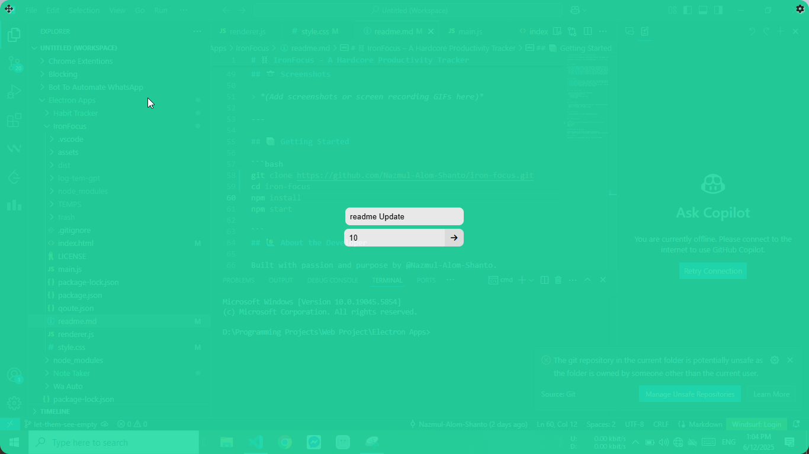
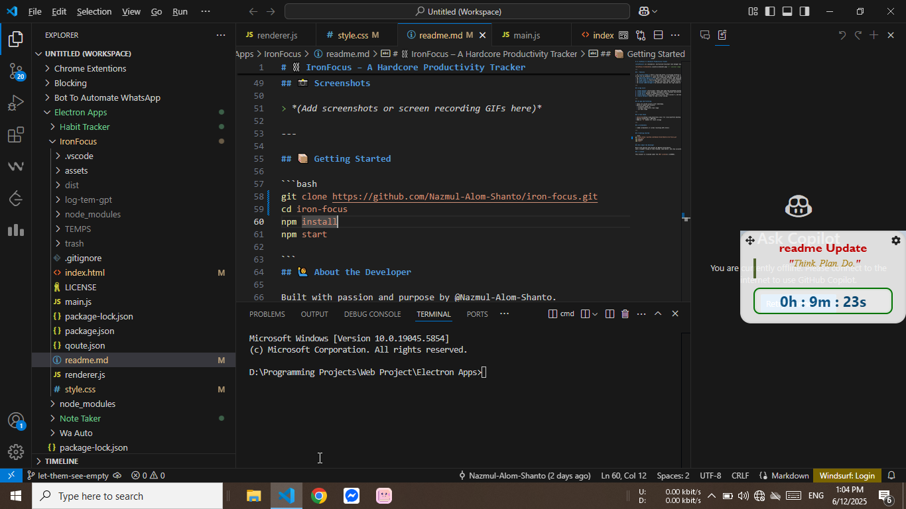
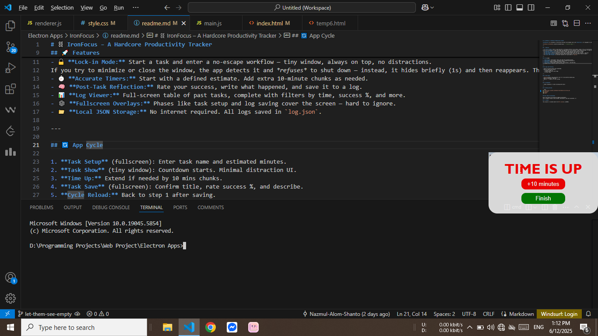
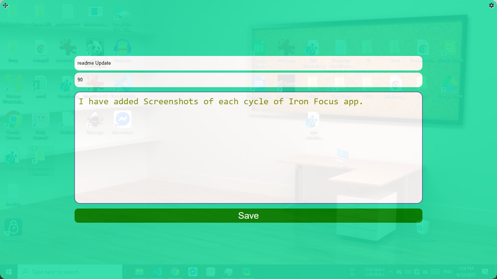
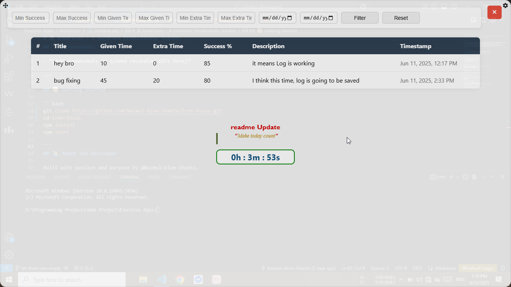
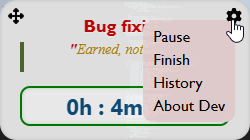

# ⛓️ IronFocus – A Hardcore Productivity Tracker

**IronFocus** is a minimalist, distraction-resistant task manager built with **Electron**. It's designed to lock you into focus — literally — and help you track your time, performance, and habits in a clean log system.

---

## 🚀 Features

- 🔒 **Lock-in Mode:** Start a task and enter a no-escape workflow — tiny window, always on top, no distractions.
If you try to minimize or close the window, the app detects it and *refuses* to shut down — instead, it hides briefly (1s) and then reappears. This forces you to stay focused and accountable.
- ⏱️ **Accurate Timers:** Start with a defined estimate. Add extra 10-minute chunks as needed.
- 🧠 **Post-Task Reflection:** Rate your success, write what happened, and save it to a log.
- 📊 **Log Viewer:** Full-screen table of past tasks, complete with filters by time, success %, and more.
- 🌑 **Fullscreen Overlays:** Phases like task setup and log saving cover the screen — hard to ignore.
- 📁 **Local JSON Storage:** No internet required. All logs saved in `log.json`.

---

## 🔄 App Cycle

1. **Task Setup** (fullscreen): Enter task name and estimated minutes.
2. **Task Show** (tiny window): Countdown starts. Minimal distraction UI.
3. **Time Up:** Extend if needed by 10 mins chunks.
4. **Task Save** (fullscreen): Confirm title, rate success %, and describe.
5. **Cycle Reload:** Back to step 1 after saving.

---

## 📂 Logs and Filtering

- Tasks are stored locally with timestamps.
- Built-in table with filters:
  - ✅ Success range (%)
  - ⏳ Given time & extra time range
  - 🗓️ Date range

---

## 🧪 Tech Stack

- [Electron](https://www.electronjs.org/) for cross-platform desktop app
- Vanilla JavaScript + DOM APIs
- Node.js `fs` module for local storage

---

## 📸 Screenshots

> 
> **Task Setup**

> 
> **Task View**

> 
> **Time Up**

> 
> **Save Task**

> 
> **View Log**

>;
>**Menu**


## 📦 Getting Started

```bash
git clone https://github.com/Nazmul-Alom-Shanto/iron-focus.git
cd iron-focus
npm install
npm start

```
## 🙋‍♂️ About the Developer

Built with passion and purpose by @Nazmul-Alom-Shanto.
Just a student trying to stay focused, code better, and stay accountable. 😄

## 📜 License

This project is licensed under the [MIT License](./LICENSE).
